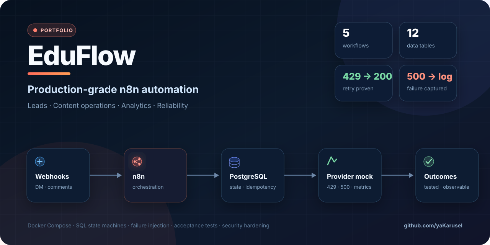
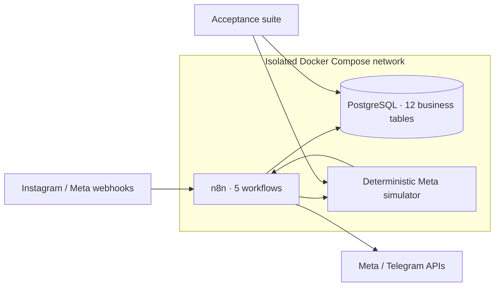

<p align="center">
  
</p>

<p align="center">
  <a href="https://github.com/yaKarusel/eduflow-n8n-automation/actions/workflows/ci.yml"></a>
  
  
  
  
</p>

<p align="center">
  <strong>Five production-shaped workflows for lead qualification, comment conversion, content operations, analytics, and failure handling.</strong>
</p>

<p align="center">
  <a href="docs/CASE_STUDY_RU.md">Русская версия кейса</a> ·
  <a href="docs/DEMO_SCRIPT.md">5-minute demo</a> ·
  <a href="docs/ARCHITECTURE.md">Architecture</a> ·
  <a href="docs/TESTING.md">Test evidence</a>
</p>

## Why this project exists

An online school can lose warm leads when Instagram DMs and keyword comments are processed manually. Content approvals get buried in chats, reporting becomes spreadsheet work, and naïve automation creates duplicate replies when webhooks are delivered twice.

EduFlow treats those problems as an engineering system, not a collection of happy-path automations. It combines n8n orchestration with PostgreSQL transactions, durable idempotency, explicit state machines, a deterministic Meta simulator, and executable acceptance tests.

## What it delivers

| Workflow | Business outcome | Reliability mechanism |
|---|---|---|
| **01 · DM Lead Qualification** | Detects intent, scores the lead, stores the conversation, and replies | Transactional deduplication and stable outbound keys |
| **02 · Comment to Lead** | Converts actionable keyword comments into leads and private replies | Ignored/actionable split with exactly-once side effects |
| **03 · Content Approval & Publishing** | Moves content from draft through approval to publication and metrics | Guarded state transitions and `FOR UPDATE SKIP LOCKED` |
| **04 · Daily Analytics** | Produces a Markdown/JSON funnel report from business tables | Deterministic SQL aggregation and daily upsert |
| **05 · Central Error Handler** | Captures sanitized, correlated workflow failures | Bounded messages, stable fingerprints, no secret payloads |

## Architecture



The public Compose stack is self-contained and exposes only Caddy. PostgreSQL and the simulator stay on an internal network. Production can add a dedicated egress gateway without changing workflow logic.

## Engineering highlights

- **Exactly-once business effects:** inbound IDs are claimed in PostgreSQL before any outbound call.
- **No fragile in-memory state:** deduplication, lifecycle state, retries, and reports survive restarts.
- **Parameterized SQL:** workflow values are bound through `$1…$N`; the validator rejects an unbound placeholder.
- **Failure injection:** the simulator can return one-shot or persistent `429` and `500` responses.
- **Mock/live parity:** the same workflow graph switches providers through environment configuration.
- **Operational discipline:** pinned image digests, healthchecks, limits, bounded logs, backups, guarded restore, and security audit.
- **No Code-node dependency:** orchestration uses standard n8n nodes; classification and aggregation live in reviewed SQL.

## Run it locally

Prerequisites: Docker Engine with Compose, Bash, OpenSSL, and about 2 GB of free RAM.

```bash
git clone https://github.com/yaKarusel/eduflow-n8n-automation.git
cd eduflow-n8n-automation
cp .env.example .env

# For a local HTTP demo, review docker-compose.override.example.yml.
# For HTTPS, replace DOMAIN/N8N_HOST/WEBHOOK_URL in .env first.
make setup
```

Create the first n8n owner, copy the Personal project ID into `.env` as `N8N_PROJECT_ID`, then run:

```bash
make import-workflows
make health
make test
make demo
```

No real Meta account is contacted while `META_MODE=mock`.

## What the acceptance suite proves

```text
✓ duplicate DM delivery creates one inbound message
✓ keyword comment becomes a lead and receives one private reply
✓ HTTP 429 is retried and finishes SENT/200
✓ persistent HTTP 500 finishes FAILED/500 and creates a sanitized error
✓ approved content reaches PUBLISHED with a deterministic publication ID
✓ daily analytics is stored once per date
✓ unexpected workflow errors reach the central handler
```

## Production boundary

The repository demonstrates production architecture in deterministic mock mode. A real client rollout additionally requires client-owned Meta Business assets, app review, current Graph API permission verification, webhook signature validation, and a controlled token-rotation process. Those steps are documented in [LIVE_MODE.md](docs/LIVE_MODE.md) and are intentionally not represented as already completed.

## Skills demonstrated

`n8n` · `PostgreSQL` · `Docker Compose` · `webhooks` · `idempotency` · `retry design` · `state machines` · `API mocking` · `acceptance testing` · `observability` · `security hardening` · `backup/restore` · `technical documentation`

## Documentation map

- [Architecture and design decisions](docs/ARCHITECTURE.md)
- [Workflow reference](docs/WORKFLOWS.md)
- [Data model](docs/DATA_MODEL.md)
- [Testing and failure scenarios](docs/TESTING.md)
- [Operations runbook](docs/RUNBOOK.md)
- [Security model](docs/SECURITY.md)
- [Russian portfolio case](docs/CASE_STUDY_RU.md)

Built as a portfolio case by [@yaKarusel](https://github.com/yaKarusel). The deployed editor remains private; a guided live demonstration is available on request.
