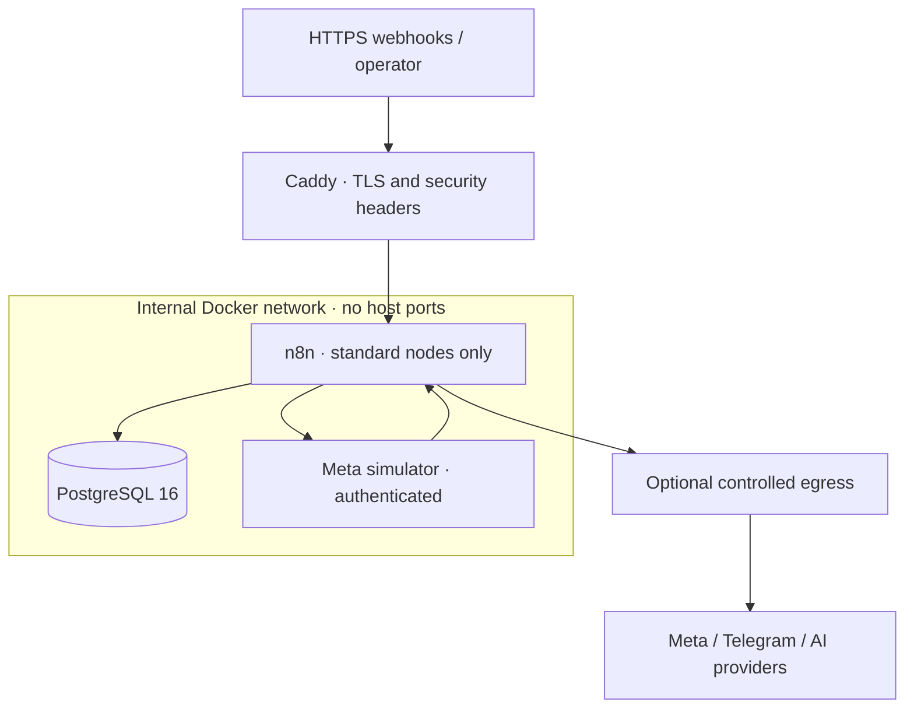
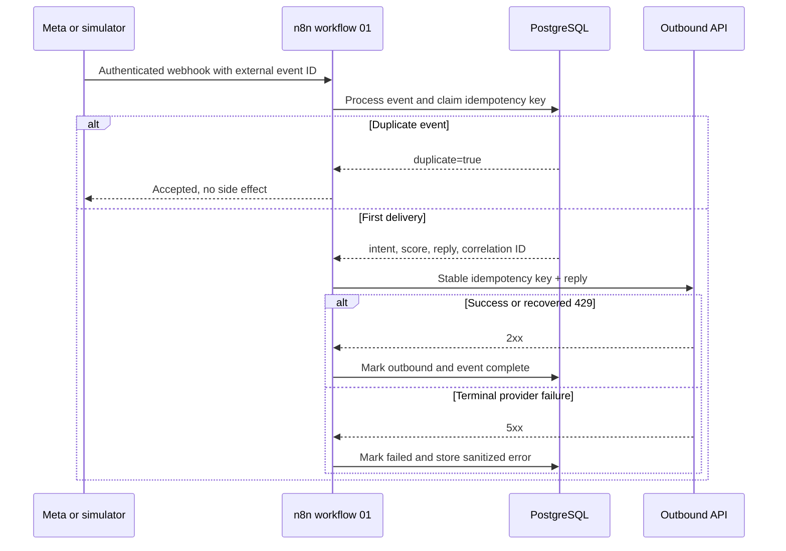

# Architecture

## Portable topology

The standalone Compose file deploys Caddy, n8n, PostgreSQL, and the deterministic mock API. Only Caddy publishes host ports. A production environment may place the n8n network namespace behind a dedicated egress gateway; this changes routing without changing workflow JSON.

## Core decisions

- **Transactional idempotency:** each external event ID is claimed in PostgreSQL before an outbound side effect. The same transaction writes the event, contact, lead, and message state.
- **Durable outbound ledger:** every intended call receives a stable key and moves through `PENDING`, `SENT`, `FAILED`, or `SKIPPED`.
- **No Code-node dependency:** workflows use Webhook, IF, Set, PostgreSQL, HTTP Request, Schedule, and Error Trigger nodes. Classification and analytics are reviewed, parameterized SQL.
- **Deterministic provider simulation:** mock responses and publication metrics are stable for a given identity, while controlled failure modes exercise retry branches.
- **Mock/live parity:** endpoint selection changes through environment configuration; workflow topology and database invariants stay the same.
- **Failure containment:** bounded retries handle transient errors. Terminal failures update business state and unexpected exceptions enter the central error workflow.
- **Portable source:** fixed workflow and credential IDs make CLI imports reproducible across fresh n8n projects.

## Inbound DM sequence

The relational model and invariants are documented in [DATA_MODEL.md](DATA_MODEL.md).
